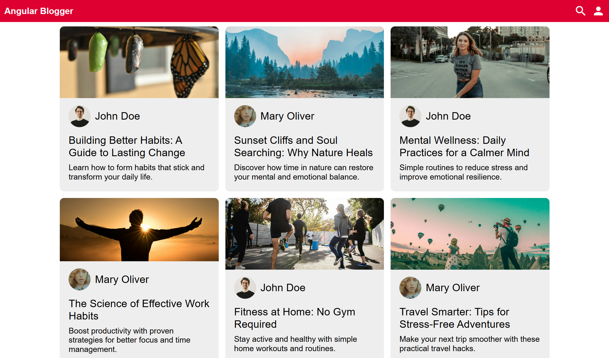

# 📝 Angular Blog

A modern, responsive blog where users can write about whatever they want, explore diverse content, and interact with a fluid and intuitive interface.

<p align="center">

</p>

## 🚀 Overview

**Angular Blog** is a web application developed with user experience in mind. It allows anyone to create an account, publish text, read articles from other authors, and explore content through an intelligent search.

## 🛠️ Technologies Used

- **Angular** – Main framework for building the SPA
- **RxJS** – Reactive programming for data and event management
- **Ng-Quill** – Rich text editor for content creation
- **SCSS** – Modular and scalable styling
- **localStorage** – Simple data persistence
- **SMACSS** – CSS architecture for organization and maintenance
- **Jasmine** – Unit and integration testing

## 📱 Mobile First

The interface was designed with a **mobile-first** approach, ensuring a fluid experience on mobile devices, tablets, and desktops.

## ✨ Features

- 🔍 **Search for content** by title, author, or description
- 📖 **Read articles** published by other users
- 🔔 **Receive notifications** about new posts and interactions
- 🧑‍💻 **Create an account** and manage your profile
- ✍️ **Write and publish content** with an advanced editor
- 🔐 **Log in and out** with session persistence
- 📱 **Responsive layout** adapts to any screen

## 📷 Content Examples

- *Building Better Habits: A Guide to Lasting Change*
- *Sunset Cliffs and Soul Searching: Why Nature Heals*
- *Fitness at Home: No Gym Required*

## 📦 Installation

```bash
git clone https://github.com/your-username/angular-blog.git
cd angular-blog
npm install
ng serve
```

## More

🔗 **Access the project online:** [Angular Blog on GitHub Pages](https://jordan-will.github.io/angular-blog/)

📬 **Contact:** [jordan.willian.mp@gmail.com](mailto:jordan.willian.mp@gmail.com)